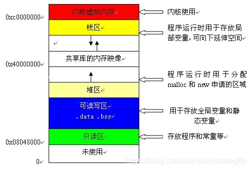

# 堆区、栈区

## 区别

注：首先堆和栈可以分为两种，一种是数据结构，另一种是和内存的分配有关，这两种虽然都有栈和堆，但是两者关系并不大，

1、栈、堆是数据结构里面的叫法，注意：有时候有人喜欢这样说 "堆栈" 其实说的就是栈而不是堆。　　

 2、堆区、栈区则是内存模型的叫法。

 

## 内存中的栈区和堆区

而C语言的内存模型分为5个区：栈区、堆区、静态区、常量区、代码区。每个区存储的内容如下：

1、栈区：存放函数的参数值、局部变量等，由编译器自动分配和释放，通常在函数执行完后就释放了，其操作方式类似于数据结构中的栈。栈内存分配运算内置于CPU的指令集，效率很高，但是分配的内存量有限，比如iOS中栈区的大小是2M。

2、堆区：就是通过new、malloc、realloc分配的内存块，编译器不会负责它们的释放工作，需要用程序区释放。分配方式类似于数据结构中的链表。“内存泄漏”通常说的就是堆区。

3、静态区：全局变量和静态变量的存储是放在一块的，初始化的全局变量和静态变量在一块区域，未初始化的全局变量和未初始化的静态变量在相邻的另一块区域。程序结束后，由系统释放。

4、常量区：常量存储在这里，不允许修改。

5、代码区：顾名思义，存放代码。

分布图：

 

### 栈区和堆区大小差异？

栈区：由图中其实可以知道，栈区是向低地址扩展的，是一块连续的内存的区域。这句话的意思是栈顶的地址和栈的最大容量是系统预先规定好的，大小在进程分配时是确定的，具体大小看编译器，操作系统。所需大小一般小于10M！太大没有意义，不符合栈是用来快速存取的目标。

堆区：堆区是向高地址扩展的，是不连续的内存区域（这是由于系统是用链表来存储的空闲内存地址的，自然是不连续的是动态分配的），因为会手动进行分配，会大一些，大小不固定。

栈区和堆区效率差异？

栈区：由系统自动分配，速度较快。但程序员是无法控制的。(只要栈的剩余空间大于所申请空间，系统将为程序提供内存，否则将报异常提示栈溢出。)

堆区：是由new分配的内存，一般速度比较慢，而且容易产生内存碎片,不过用起来最方便。（首先应该知道操作系统有一个记录空闲内存地址的链表，当系统收到程序的申请时，会遍历该链表，寻找第一个空间大于所申请空间的堆结点，然后将该结点从空闲结点链表中删除，并将该结点的空间分配给程序，另外，对于大多数系统，会在这块内存空间中的首地址处记录本次分配的大小，这样，代码中的 delete语句才能正确的释放本内存空间。另外，由于找到的堆结点的大小不一定正好等于申请的大小，系统会自动的将多余的那部分重新放入空闲链表中）

小结：其实从上面的知识我们可以看出，如果存放在堆中的数据如果不进行释放，很可能造成内存泄漏，因为并不一定能触发gc机制回收。所以对于堆中的内存使用，我们要记得用完释放。

 

## 数据结构中的栈和堆

什么是数据结构？

存储与组织数据的方式。我感觉更应强调数据的组织方式，比如好多数据结构的存储方式都是用的数组，但他们根据自身的特点进行了封装，因为存储方式只有顺序存储和链式存储两种，但是却可以组合成多种数据结构。　

 常用的数据结构有哪些？

数组、栈、堆、队列、链表等等。

-  栈

栈是限定仅仅在表尾进行插入和删除操作的线性表，把允许插入和删除的一端称之为栈顶，另外一端称之为栈底。特点：后进先出，称之为后进先出线性表。

栈的应用：递归。 

- 堆

是一种经过排序的树形数据结构，每一个节点都有一个值，通常所说堆的数据结构是二叉树，堆的存取是随意的。所以堆在数据结构中通常可以被看做是一棵树的数组对象。而且堆需要满足一下两个性质：
（1）堆中某个节点的值总是不大于或不小于其父节点的值；
（2）堆总是一棵完全二叉树。

堆的应用：堆排序，快速找出最大值、最小值，简化时间复杂度，像这样支持插入元素和寻找最大（小）值元素的数据结构称之为优先队列。